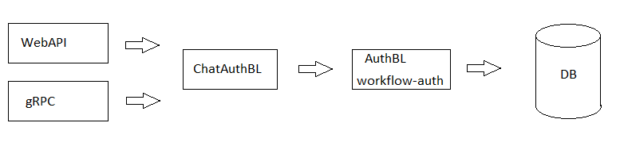

# Authentication service

Read this in other languages: [English](AuthenticationService.md), [Russian/Русский](AuthenticationService.ru.md).

Service for authentication and getting session tokens 

## Description of the authentication API

The [workflow-auth](https://github.com/alexeysp11/workflow-auth) library is used as an authentication service (in particular, the [AuthResolverDB](https://github.com/alexeysp11/workflow-auth/blob/main/docs/authbl/AuthResolverDB.md) class).

Used methods of the [AuthResolverDB](https://github.com/alexeysp11/workflow-auth/blob/main/docs/authbl/AuthResolverDB.md) class:
- `AddUser()`;
- `VerifyUserCredentials()`.