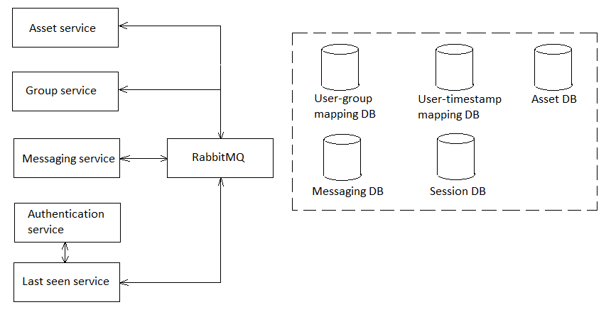

# MessagingService

Read this in other languages: [English](MessagingService.md), [Russian/Русский](MessagingService.ru.md).

Service for processing messages 

## Description  

- Starting a conversation: 
    - User chooses another user to start a conversation;
    - Server queries and gets if these two users were in private chat already; 
    - Display all the info related to the private chat.
- Handles messages from the users:
    - Gets message from the sender;
    - Inserts the message into DB `MessagingDB`;
    - If receiver is online and not set "Notifications off" for the chat, then send the message: 
        - If the message is sent, then mark it as "sent".
        - If the message is no sent, then mark it as "pending", set receiver's status offline and send the info about the status using RabbitMQ to the **Last seen service**.
    - If receiver is offline, then mark the massage as "pending".
- Handles client's request for getting all messages in a chat (either all or that are appeared after the specified timestamp).
- Handles client's request for changing message status.
- Uses queues in RabbitMQ for communicating with **Last seen service** about the user's statuses (reading and writing).

## Network messages format

The [ChatMessagingService](../Core/Services/ChatMessagingService.md) class is responsible for processing network requests. 

## Tables in DB

- [chat_user](../DbTables/chat_user.md)
- [chat_message](../DbTables/chat_message.md)
- [chat_cms_request](../DbTables/chat_cms_request.md) (change message status)
- [chat_message_status](../DbTables/chat_message_status.md)
- [chat_conversation](../DbTables/chat_conversation.md)
- [chat_entity_type](../DbTables/chat_entity_type.md)
- [chat_entity_status](../DbTables/chat_entity_status.md)
- [chat_notification_policies](../DbTables/chat_notification_policies.md)
- [chat_e2ee_algorithm_type](../DbTables/chat_e2ee_algorithm_type.md)
