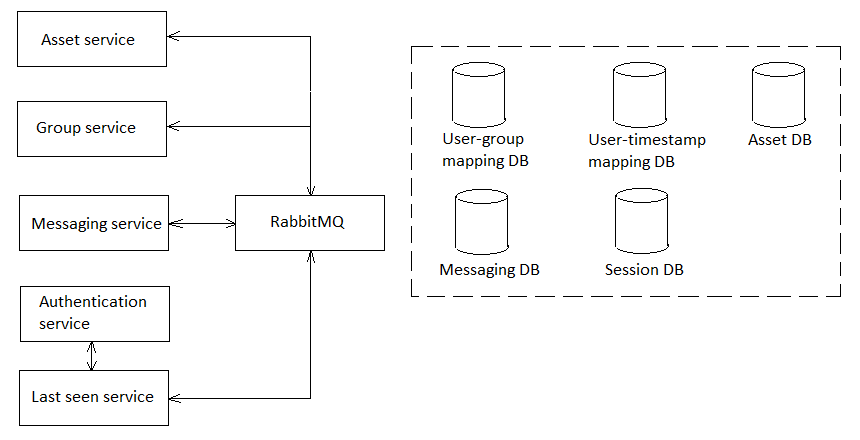

# Messaging service

Доступно на других языках: [English/Английский](MessagingService.md), [Russian/Русский](MessagingService.ru.md).

Сервис обработки сообщений 

## Описание 

- Начало диалог:
    - Пользователь выбирает другого пользователя, чтобы начать диалог;
    - Сервер запрашивает информацию о том, были ли эти два пользователя уже в приватном чате;
    - Отображать всю информацию, связанную с приватным чатом.
- Обрабатывает сообщения от пользователей:
    - Получает сообщение от отправителя;
    - Записывает сообщение в БД `MessagingDB`;
    - Если получатель онлайн и не проставлено "Отключить уведомления" для этого чата, то отправляем сообщение:
        - Если сообщение отправлено, то помечаем сообщение как "отправлено".
        - Если не получается отправить, то помечаем сообщение как "ожидающее отправку", ставим статус получателя оффлайн и отправляем информацию о статусе по RabbitMQ на сервис **Last seen service**.
    - Если получатель оффлайн, то помечаем сообщение как "ожидающее отправку".
- Обрабатывает клиентский запрос на получение всех сообщений (за всё время или после определенного времени).
- Клиентский запрос на изменение статуса сообщения.
- Использует очереди в RabbitMQ для коммуникации с сервисом **Last seen service** по поводу статуса пользователей (чтение и запись). 

## Описание сетевого взаимодействия 

- Отправка сообщения: 
    - Прямой ход:
        - `message_uid: string` (only for receiver), 
        - `sender_uid: string`, 
        - `receiver_uid: string`, 
        - `text_content: string`, 
        - `send_timestamp: DateTime`,
        - `receiver_type_uid: string` (personal chat, group chat).
    - Обратный ход (только для отправителя): 
        - `message_uid: string`,
        - `status_uid: string` (pending, sent).
- Получение сообщений:
    - Запрос: 
        - `to_use_timestamp: DateTime` (при необходимости актуальный timestamp будет вычислен на сервере).
    - Ответ: 
        - массив сообщений (см. прямой ход).
- Изменение статуса сообщения: 
    - `message_uid: string`,
    - `user_uid: string`,
    - `status_uid: string` (read, deleted_for_sender, deleted_for_everybody).

## Таблицы в БД

- user: 
    - `user_id: integer not null`, 
    - `user_uid: varchar not null`, 
    - `username: varchar not null`, 
    - `email: varchar`, 
    - `phone: varchar not null`, 
    - `image: blob`, 
    - `chat_entity_status_id: integer not null` -> chat_entity_status, 
    - `last_seen_timestamp: timestamp not null`.
- message: 
    - `message_id: integer not null`, 
    - `message_uid: varchar not null`,
    - `sender_id: integer not null` -> user, 
    - `receiver_id: integer` -> user, 
    - `conversation_id: integer` -> conversation,
    - `group_id: integer` -> group,
    - `chat_entity_type_id: integer not null` -> chat_entity_type,
    - `text_content: text`, 
    - `send_timestamp: timestamp not null`, 
    - `message_status_id: integer not null` -> message_status.
- change_status_request (for changing status of a message):
    - `message_id: integer not null` -> message, 
    - `user_id: integer not null` -> user,
    - `message_status_id: integer not null` -> message_status,
    - `request_timestamp: timestamp not null`.
- message_status: 
    - columns: 
        - `message_status_id: integer not null`,
        - `uid: varchar not null`,
        - `name: varchar not null`.
    - possible values: 
        - pending, 
        - sent, 
        - read, 
        - deleted_for_sender,
        - deleted_for_everybody,
        - deleted_for_group_user.
- conversation: 
    - `conversation_id: integer not null`,
    - `uid: varchar not null`,
    - `user_one_id: integer not null` -> user,
    - `user_two_id: integer not null` -> user,
    - `user_one_np_id: integer not null` -> notification_policies,
    - `user_two_np_id: integer not null` -> notification_policies, 
    - `user_one_status_id: integer` -> chat_entity_status (shows if the **user one** was blocked by **user two**), 
    - `user_two_status_id: integer` -> chat_entity_status (shows if the **user two** was blocked by **user one**).
- chat_entity_type:
    - columns: 
        - `chat_entity_type_id: integer not null`,
        - `uid: varchar not null`,
        - `name: varchar not null`.
    - possible values: 
        - user,
        - personal chat (conversation), 
        - group chat,
        - bot.
- chat_entity_status: 
    - coulumns: 
        - `chat_entity_status_id: integer not null`, 
        - `uid: varchar not null`,
        - `name: varchar not null`.
    - possible values:
        - online, 
        - offline, 
        - blocked, 
        - deleted.
- notification_policies:
    - coulumns: 
        - `notification_policies_id: integer not null`, 
        - `uid: varchar not null`,
        - `name: varchar not null`.
    - possible values: 
        - notifications on,
        - notifications off.
- e2ee_algorithm:
    - coulumns: 
        - `e2ee_algorithm_id: integer not null`, 
        - `uid: varchar not null`,
        - `name: varchar not null`.
    - possible values: 
        - AES,
        - DES,
        - Tripple DES, 
        - RSA, 
        - Blowfish, 
        - Twofish, 
        - RC4,
        - TEA, 
        - xxTEA.
